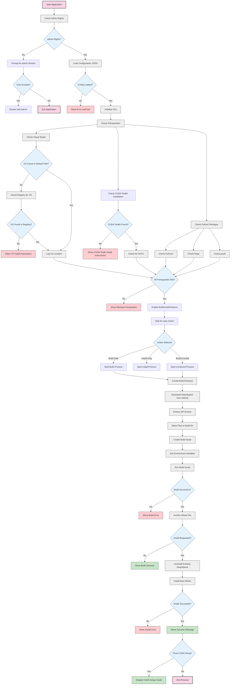

# DeepSpeed Windows Patcher

A graphical tool to simplify building and installing DeepSpeed on Windows systems. This tool automates the build process, manages dependencies, and provides clear guidance for CUDA setup. FYI, this was going to be a patcher for earlier builds of DeepSpeed, but I moved the code to be a builder for DeepSpeed 0.15.x and later, but Im too lazy to change the name.

**NOTE:** If you cannot use the tool for some reason, the **manual** instructions to perform are at the bottom of this page [Manual Builds of DeepSpeed 0.15.0 and later](#manual-builds-of-deepspeed-0150-and-later)

# Table of Contents
- [Important Version Compatibility Information](#important-version-compatibility-information)
  - [Version Compatibility Example](#version-compatibility-example)
  - [Common Compatibility Issues](#common-compatibility-issues)
- [Purpose](#purpose)
- [System Requirements](#system-requirements)
  - [Mandatory Prerequisites](#mandatory-prerequisites)
  - [Python Package Dependencies](#python-package-dependencies)
- [Download and Usage](#download-and-usage)
  - [Getting the Tool](#getting-the-tool)
  - [Before Running the Tool](#before-running-the-tool)
  - [Running the Tool](#running-the-tool)
  - [Important Notes](#important-notes)
  - [Verification After Building](#verification-after-building)
  - [Common Setup Mistakes to Avoid](#common-setup-mistakes-to-avoid)
  - [Quick Environment Check](#quick-environment-check)
- [Startup Checks](#startup-checks)
- [Usage Guide](#usage-guide)
  - [Building DeepSpeed](#building-deepspeed)
  - [Build Management](#build-management)
- [Configuration File](#configuration-file-deepspeed_configjson)
  - [Adding New Versions](#adding-new-versions)
- [Additional Notes](#additional-notes)
- [Troubleshooting](#troubleshooting)
- [Notes for Developers](#notes-for-developers)
- [Manual Builds of DeepSpeed 0.15.0 and later](#manual-builds-of-deepspeed-0150-and-later)
- [Support](#support)
- [Application Flowchart](#application-flowchart)

---


---

## Important Version Compatibility Information

DeepSpeed wheels are environment-specific and must be built for your exact configuration. A built wheel is tied to:

1. **Python Major Version**
   - Must match exactly (e.g., 3.10.x, 3.11.x)
   - A wheel built for Python 3.10 won't work on Python 3.11 or 3.9

2. **PyTorch Version**
   - Must match the major and minor version used during build
   - A wheel built with PyTorch 2.2.1 won't work with PyTorch 2.3.0
   - A wheel built with PyTorch 2.1.0 won't work with PyTorch 2.2.0

3. **CUDA Versions** (There are TWO different CUDA versions to consider):
   
   a) **PyTorch CUDA Version**
   - This is the CUDA version that PyTorch was built with
   - Can be checked with `torch.version.cuda`
   - This is determined when you install PyTorch
   - Example: PyTorch 2.1.0+cu121 uses CUDA 12.1

   b) **NVIDIA CUDA Toolkit Version**
   - This is the full CUDA development toolkit installed on your system
   - Used for compiling DeepSpeed's CUDA extensions
   - Must be installed separately from PyTorch
   - Should be compatible with (same or newer than) your PyTorch CUDA version

   For example:
   - If PyTorch uses CUDA 11.8 → NVIDIA CUDA Toolkit should be 11.8 or higher
   - If PyTorch uses CUDA 12.1 → NVIDIA CUDA Toolkit should be 12.1 or higher

### Version Compatibility Example
```
Environment A (where wheel was built):
- Python 3.11.5
- PyTorch 2.1.0+cu121 (CUDA 12.1)
- NVIDIA CUDA Toolkit 12.1

This wheel will ONLY work in environments with:
- Python 3.11.x (any minor version of 3.11)
- PyTorch 2.1.x (must match major.minor version)
- PyTorch built with CUDA 12.1
- NVIDIA CUDA Toolkit 12.1 or higher
```

### Common Compatibility Issues
- Installing a wheel built with Python 3.10 in a Python 3.11 environment
- Using a wheel built with PyTorch 2.1.x on a system with PyTorch 2.2.x
- Using a wheel built against CUDA 11.8 with PyTorch built for CUDA 12.1
- Having mismatched PyTorch CUDA and NVIDIA CUDA Toolkit versions

## Purpose

Building DeepSpeed on Windows can be challenging due to specific requirements and environment setup needs. This tool:
- Automates the build process
- Verifies system prerequisites
- Manages build environments
- Archives built wheel files
- Provides CUDA setup guidance
- Offers both build-only and build-with-install options

## System Requirements

### Mandatory Prerequisites
1. **NVIDIA GPU with CUDA Support**
   - Compatible NVIDIA GPU
   - NVIDIA Display Driver installed

2. **NVIDIA CUDA Toolkit**
   - Version 11.0 or later required
   - Must include:
     - CUDA Development Compiler (nvcc)
     - CUDA Development Libraries (CUBLAS)
     - CUDA Runtime Libraries
   - Download from: [NVIDIA CUDA Toolkit Archive](https://developer.nvidia.com/cuda-toolkit-archive)

3. **Visual Studio with C++ Build Tools**
   - Visual Studio 2019 or 2022 (Community Edition or BuildTools)
   - Must include "Desktop development with C++"
   - Download from: [Visual Studio Community](https://visualstudio.microsoft.com/vs/community/)

4. **Python Environment**
   - Python 3.8 or later
   - PyTorch installed with CUDA support
   - **Admin rights** for installation (This is a Microsoft requirement for DeepSpeed builds).

### Python Package Dependencies
- PyTorch (must be installed manually)
- ninja (auto-installed if missing)
- psutil (auto-installed if missing)

## Download and Usage

### Getting the Tool

1. Clone the repository:<br>
`git clone https://github.com/erew123/deepspeedpatcher`

### Before Running the Tool

⚠️ **IMPORTANT**: Complete these steps in order:

1. **Install Visual Studio or Visual Studio Build Tools**
   - Install Visual Studio 2019/2022 Community or Build Tools
   - During installation, select "Desktop development with C++"
        - ✅ MSVC v142 - VS 2019 C++ x64/x86 build tools (Latest version is fine)
        - ✅ Windows 10 or 11 SDK (Any recent version, so 10.0.19041.0 or newer is fine)
        - ✅ C++ core features - Build Tools
        - ✅ C++/CLI support for v142 build tools
        - ✅ C++ Modules for v142 build tools
        - ✅ C++ CMake tools for Windows
   - This must be done before proceeding

2. **Install NVIDIA CUDA Toolkit**
   - Install the appropriate version based on your PyTorch's CUDA version
   - Example: For PyTorch with CUDA 12.1, install CUDA Toolkit 12.1
   - Must include development components (nvcc compiler)
   - Only specific components **should** be required:
        - ✅ CUDA > Development > Compiler > nvcc
        - ✅ CUDA > Development > Libraries > CUBLAS
        - ✅ CUDA > Runtime > Libraries > CUBLAS

3. **Set Up Python Environment**
   - Create and activate your Python environment (venv, conda, etc.)
   - Install PyTorch with the desired CUDA version
   - Verify PyTorch CUDA is working:
     ```python
     python -c "import torch; print(f'PyTorch CUDA available: {torch.cuda.is_available()}, Version: {torch.version.cuda}')"
     ```

### Running the Tool

1. **Activate Your Target Environment**
   ```bash
   # If using venv
   .\venv\Scripts\activate

   # If using conda
   conda activate your_environment_name
   ```

2. **Launch the Tool**
   ```bash
   python builddeepspeed.py
   ```
   - The tool will request administrative privileges
   - It will perform system checks automatically

### Important Notes

- **Environment Matching**: The DeepSpeed wheel will be built for the Python environment that launches the tool
- **Admin Rights**: The tool requires administrative privileges to build DeepSpeed. (This is a Microsoft requirement for DeepSpeed builds)
- **Build Location**: By default, builds occur in a `deepspeed` subdirectory where the tool is run
- **Archived Wheels**: Completed wheel builds are stored in `deepspeed_wheels` with version information
- **Set your CUDA_HOME path**: DeepSpeed needs to be able to find and access the Nvidia CUDA Toolkit's `nvcc.exe` each time DeepSpeed starts up. As such, each and every Python environment you are running that uses DeepSpeed will need its CUDA_HOME environment path variable to be set correctly. Guides on doing this are in the tool.

### Verification After Building

After building and installing the wheel to your Python environment, verify DeepSpeed with `ds_report` or:
```bash
python -c "import deepspeed; deepspeed.show_env()"
```

### Common Setup Mistakes to Avoid

1. **Wrong Environment Active**
   - Building a wheel in one environment but trying to use in another that doesnt match
   - Not activating the target environment before running the tool
   - Not setting the CUDA_HOME environment after installing the wheel and starting your Python environment

2. **Incorrect Order of Installation**
   - Installing CUDA Toolkit after PyTorch
   - Not having Visual Studio/Build Tools installed first

3. **Version Mismatches**
   - PyTorch CUDA version doesn't match CUDA Toolkit
   - Using wrong Python version for your needs

### Quick Environment Check

Run these commands before starting to verify your setup (these checks are performed by the tool on start-up):
```bash
# Check Python version
python --version

# Check PyTorch and its CUDA version
python -c "import torch; print(f'PyTorch {torch.__version__}, CUDA {torch.version.cuda if torch.cuda.is_available() else "Not Available"}')"

# Check CUDA Toolkit
nvcc --version
```

All these components must be correctly installed and compatible before running the tool.


## Startup Checks

The tool performs several verification steps on launch:

1. **Administrative Rights Check**
   - Verifies admin privileges
   - Offers to restart with elevated privileges if needed
   - Microsoft's routine for compiling DeepSpeed requires Admin rights.

2. **Visual Studio Detection**
   - Checks for VS2019/VS2022 installations
   - Verifies presence of C++ build tools

3. **CUDA Toolkit Verification**
   - Scans for installed CUDA versions
   - Verifies nvcc compiler availability
   - Checks CUBLAS presence

4. **Python Environment Check**
   - Verifies Python version
   - Checks PyTorch installation and CUDA availability
   - Auto-installs missing dependencies (except PyTorch)

## Usage Guide

### Building DeepSpeed

1. **Launch the Application**
   - Run as administrator
   - The tool will perform initial system checks

2. **Configure Build Settings**
   - Select DeepSpeed version
   - Choose CUDA version
   - Set installation directory
   - Configure build options (typically left unchecked for Windows)

3. **Build Options**
   - **Build Only**: Creates wheel file without installation
   - **Install Built Wheel**: Installs previously built wheel
   - **Build and Install**: Performs both operations
   - **CUDA_HOME Setup Guide**: Shows CUDA_HOME configuration instructions

### Build Management

The tool manages builds in an organized way:

1. **Work Directory Structure**
   ```
   root/
   ├── deepspeed/          # Temporary build directory
   └── deepspeed_wheels/   # Archive directory
       └── deepspeed_[version]_cuda[version]_py[version]/
           └── wheelfile.whl
   ```

2. **Cleanup Process**
   - Automatically cleans build directory before each build
   - Preserves built wheels in version-specific archives
   - Maintains separate directories for different configurations

## Configuration File (deepspeed_config.json)

The tool uses a JSON configuration file to manage available versions:

```json
{
    "versions": {
        "0.15.0": {
            "url": "https://github.com/microsoft/DeepSpeed/archive/refs/tags/v0.15.0.zip",
            "cuda_min": "11.0"
        },
        "0.15.1": {
            "url": "https://github.com/microsoft/DeepSpeed/archive/refs/tags/v0.15.1.zip",
            "cuda_min": "11.0"
        }
    }
}
```

### Adding New Versions

To add support for new DeepSpeed versions:

1. Add a new entry to the "versions" object
2. Specify the GitHub release URL
3. Set minimum CUDA version requirement

Note: This tool supports DeepSpeed 0.15.0 and later. Earlier versions may have different build requirements and are not supported.

## Additional Notes

1. **CUDA_HOME Environment**
   - The tool provides guidance for setting CUDA_HOME
   - Different options for system-wide, conda, and venv setups
   - Verification steps included

2. **Build Artifacts**
   - Wheels are archived with version information
   - Each build creates a clean environment
   - Previous builds are preserved in the archive directory

3. **Error Handling**
   - Detailed error messages in the log
   - Suggestions for common issues
   - Build process can be retried if needed

4. **Log File**
   - All operations are logged to 'deepspeed_build.log'
   - Includes timestamps and detailed progress information
   - Useful for troubleshooting

## Troubleshooting

1. **Build Failures**
   - Verify CUDA installation completeness
   - Check Visual Studio installation
   - Ensure PyTorch is installed with CUDA support
   - Review log file for specific errors

2. **CUDA Issues**
   - Confirm CUDA_HOME is set correctly
   - Verify nvcc.exe is accessible
   - Check CUDA version compatibility with PyTorch

3. **Installation Issues**
   - Run as administrator
   - Check Python environment isolation
   - Verify all prerequisites are met

## Notes for Developers

- The tool is designed for Windows 10/11 environments
- Build options are minimized for Windows compatibility
- The configuration file can be extended for future versions
- Error handling prioritizes user feedback

## Manual Builds of DeepSpeed 0.15.0 and later

**Building DeepSpeed on Windows - Key Requirements and Observations**

#### Required Software
- Visual Studio Build Tools or Visual Studio Community Edition with "Desktop development with C++" workload
  Required Components:
    - MSVC v142 - VS 2019 C++ x64/x86 build tools
    - Windows 10 SDK (10.0.19041.0 or newer)
    - C++ core features - Build Tools
    - C++/CLI support for v142 build tools
    - C++ Modules for v142 build tools
    - C++ CMake tools for Windows
- NVIDIA CUDA Toolkit (compatible with your PyTorch installation)
- Python with PyTorch CUDA build installed (e.g., torch==2.4.1+cu121 for CUDA 12.1)
- Ninja build system (`pip install ninja`) (Required for CUDA compilation)
- psutil (`pip install psutil`) (I believe this is needed)

Note: If using Visual Studio Code instead of Visual Studio, make sure you've installed the actual Visual Studio Build Tools separately - VS Code's C++ extension default selection alone is not sufficient.

#### CUDA Toolkit Installation
- Only specific components are required:
  - CUDA > Development > Compiler > nvcc
  - CUDA > Development > Libraries > CUBLAS
  - CUDA > Runtime > Libraries > CUBLAS
- Full installation is not necessary, saving download/install time

#### Visual Studio Environment Differences
1. Visual Studio (Full Version):
   - Developer Command Prompt available from Start Menu
   - VS environment variables automatically set
   - 64-bit toolchain readily available

2. Visual Studio Code:
   - No built-in Developer Command Prompt
   - Must manually run vcvars64.bat from:
     `C:\Program Files (x86)\Microsoft Visual Studio\2019\BuildTools\VC\Auxiliary\Build\vcvars64.bat`
   - Important: Must use 64-bit environment (vcvars64.bat, not vcvars32.bat)

### Key Findings and Gotchas

#### Environment Setup is Critical:
- The Visual Studio environment MUST be properly initialized before building
- Using the wrong architecture (32-bit vs 64-bit) will cause compilation failures. 0.15.0 seems to need a x64 Developer Console
- CUDA_HOME and CUDA_PATH must point to the correct CUDA installation that matches your PyTorch CUDA version

#### Build Process:
- Must be run with **administrative privileges** (This is a requirement of the Microsoft scripts that build DeepSpeed)
- Should be run from a proper x64 Developer Command Prompt or environment
- Build will fail if Visual Studio x64 toolchain isn't properly initialized as part of Visual Studio/Visual Studio Code

#### Common Issues:
- aio.lib and cufile.lib errors can be ignored on Windows
- dskernels module errors often indicate incorrect CUDA environment setup
- Build may appear to hang during CUDA kernel compilation (be patient and give it a few minutes)

#### Manual Build Steps
After downloading and extracting a DeepSpeed 0.15.x (or later) build, open a Visual Studio x64 Developer Command Prompt (vcvars64.bat) **as Administrator** (or initialize VS environment manually) and then start the desired Python environment you want to build for.


You will need to copy/paste the following commands into the command prompt window.

Set required environment variables to point to your Nvidia CUDA Toolkit just before the bin path where nvcc.exe is located (example below, but you need to confirm your paths to the correct location):
```
set CUDA_HOME=C:\Program Files\NVIDIA GPU Computing Toolkit\CUDA\v12.1
set CUDA_PATH=C:\Program Files\NVIDIA GPU Computing Toolkit\CUDA\v12.1
set DISTUTILS_USE_SDK=1
```

You can verify environment is correctly set by testing NVCC and also CL:
```
nvcc -V    # Should show CUDA version
cl         # Should show MSVC version
```

Set DeepSpeed build options to 0

```
set DS_BUILD_AIO=0
set DS_BUILD_CUTLASS_OPS=0
set DS_BUILD_EVOFORMER_ATTN=0
set DS_BUILD_FP_QUANTIZER=0
set DS_BUILD_RAGGED_DEVICE_OPS=0
set DS_BUILD_SPARSE_ATTN=0
```

If necessary, you can check your environment variables by running `set` at the command prompt you are in to see a list of all environment variables that have been set.

You should now be in your Administrative x64 Developer command prompt/console, with your Python environment that you want to build DeepSpeed for loaded up, your CUDA_HOME and CUDA_PATH set correctly as well as your DeepSpeed build options set, so you can move into your extracted DeepSpeed folder run: 
```
python setup.py bdist_wheel
```

When this has completed, if successful, there will be a `dist` folder within the DeepSpeed folder that contains your compiled wheel. You can install this with `pip install deepspeed-xxxxxxxxxx.whl` where the x's will be unique to your environment build.

#### Verification
After building and installing the wheel, verify CUDA availability with `ds_report` or a Python Script:
```
import torch
print(torch.cuda.is_available())
import deepspeed
from deepspeed.ops.op_builder import OpBuilder
```

- `torch.cuda.is_available()` should return True
- `ds_report` should show CUDA is available and correctly configured
- No warnings about missing CUDA components in the output

#### Additional Notes
Build process needs VS2019 or newer (VS2019 Build Tools minimum requirement)<br>
CUDA version must be compatible with installed PyTorch version<br>
Wheel files are specific to Python version, CUDA version, and Windows architecture<br>
Building in a clean directory prevents potential conflicts<br>
**Set your CUDA_HOME path**: DeepSpeed needs to be able to find and access the Nvidia CUDA Toolkit's `nvcc.exe` each time DeepSpeed starts up. As such, each and every Python environment you are running that uses DeepSpeed will need its CUDA_HOME environment path variable to be set correctly. Guides on doing this are in the tool.

#### Manual Instructions Flowchart

```mermaid
flowchart TD
    A[Start Manual Build Process] --> B[Prerequisites Check]
    
    B --> C[Visual Studio Requirements]
    C --> C1[VS2019 or newer with C++ Workload]
    C1 --> C2[Required Components Check]
    C2 --> C3["MSVC v142 Build Tools
    Windows 10 SDK
    C++ Core Features
    C++/CLI Support
    C++ Modules
    C++ CMake Tools"]
    
    B --> D[CUDA Toolkit Requirements]
    D --> D1[Install Required Components]
    D1 --> D2["CUDA Compiler (nvcc)
    CUBLAS Development
    CUBLAS Runtime"]
    
    B --> E[Python Requirements]
    E --> E1["Compatible PyTorch CUDA
    Ninja Build System
    psutil"]
    
    C3 & D2 & E1 --> F[Environment Setup]
    
    F --> G[Launch VS x64 Developer Command Prompt as Administrator]
    
    G --> I[Environment Variables Required]
    I --> I1["CUDA_HOME
    CUDA_PATH
    DISTUTILS_USE_SDK"]
    
    I1 --> I2["Instructions:
    set CUDA_HOME=C:\Program Files\NVIDIA GPU Computing Toolkit\CUDA\v12.1
    set CUDA_PATH=C:\Program Files\NVIDIA GPU Computing Toolkit\CUDA\v12.1
    set DISTUTILS_USE_SDK=1"]
    
    I2 --> J[DeepSpeed Build Options Required]
    J --> J1["DS_BUILD_AIO
    DS_BUILD_CUTLASS_OPS
    DS_BUILD_EVOFORMER_ATTN
    DS_BUILD_FP_QUANTIZER
    DS_BUILD_RAGGED_DEVICE_OPS
    DS_BUILD_SPARSE_ATTN"]
    
    J1 --> J2["Instructions:
    set DS_BUILD_AIO=0
    set DS_BUILD_CUTLASS_OPS=0
    set DS_BUILD_EVOFORMER_ATTN=0
    set DS_BUILD_FP_QUANTIZER=0
    set DS_BUILD_RAGGED_DEVICE_OPS=0
    set DS_BUILD_SPARSE_ATTN=0"]
    
    J2 --> K[Optional Environment Verification]
    K --> |Optional| K1[Test nvcc -V]
    K1 --> |Optional| K2[Test cl]
    
    K --> L[Build Process]
    K1 --> L
    K2 --> L
    L --> M[python setup.py bdist_wheel]
    
    M --> N{Build Successful?}
    N -->|Yes| O[Wheel file in dist folder]
    O --> P[Install with pip]
    P --> Q[Verify Installation]
    Q --> Q1["Run ds_report
    Test torch.cuda.is_available()
    Check for CUDA warnings"]
    
    N -->|No| R[Common Issues]
    R --> R1["Check VS x64 environment
    Verify CUDA paths
    Check admin rights
    Wait for CUDA compilation"]
    R1 --> F
    
    classDef prereq fill:#cce5ff,stroke:#004085,stroke-width:1px;
    classDef env fill:#fff3cd,stroke:#856404,stroke-width:1px;
    classDef vars fill:#f8d7da,stroke:#721c24,stroke-width:1px;
    classDef instructions fill:#d4edda,stroke:#155724,stroke-width:1px;
    classDef build fill:#d1ecf1,stroke:#0c5460,stroke-width:1px;
    classDef verify fill:#e2e3e5,stroke:#383d41,stroke-width:1px;
    classDef error fill:#f8d7da,stroke:#721c24,stroke-width:1px;
    classDef optional fill:#e2e3e5,stroke:#383d41,stroke-width:1px,stroke-dasharray: 5 5;
    
    class B,C,C1,C2,C3,D,D1,D2,E,E1 prereq;
    class F,G env;
    class I,J vars;
    class I1,J1 vars;
    class I2,J2 instructions;
    class L,M,N,O,P build;
    class Q,Q1 verify;
    class R,R1 error;
    class K,K1,K2 optional;
```




## Support

For DeepSpeed-specific issues, refer to:
- [DeepSpeed GitHub](https://github.com/microsoft/DeepSpeed)
- [DeepSpeed Documentation](https://www.deepspeed.ai/)

For tool-specific issues:
- Check the log file
- Verify system requirements
- Follow the CUDA setup guide
- I am not Microsoft, I do not make DeepSpeed, I do not support DeepSpeed, please dont ask me questions about DeepSpeed

---

### Application Flowchart


